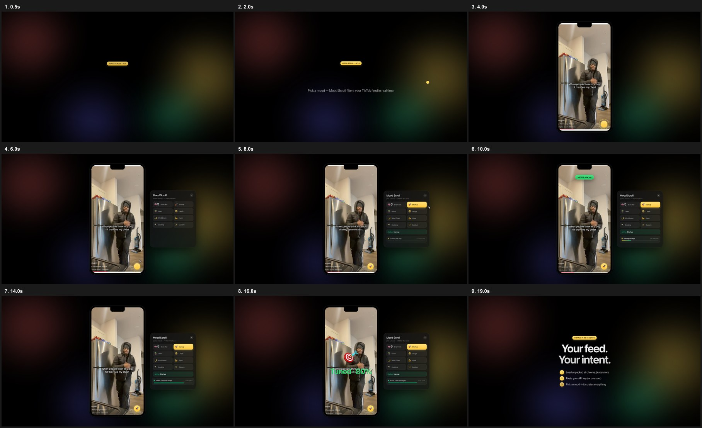

# Mood Scroll

**Pick a mood. TikTok scrolls itself.**

Chrome extension that classifies every video on your For You feed, auto-likes matches, and skips everything else — so TikTok's algorithm learns what you actually want.



## Quick start

1. Download **`mood-scroll-extension.zip`** from this repo and unzip.
2. Open **chrome://extensions** → enable **Developer mode** → **Load unpacked** → select the **`chrome-mv3`** folder.
3. Paste your OpenAI API key on the options page ([get one free](https://platform.openai.com/api-keys)).
4. Open **tiktok.com/foryou** → tap the yellow **✨** button.

Full install guide, all 8 modes, privacy notes, and troubleshooting: **[SETUP.md](./SETUP.md)**

## Modes

| Mode | What it matches |
|------|-----------------|
| ⏩ Auto Scroll | Hands-off — watches everything, auto-likes, advances every 5s |
| 🧠💀 Brain Rot | AI slop, stacked edits, sigma content |
| 🍳 Cooking | Recipe demos and technique |
| 😂 Laugh | Genuine comedy |
| 💎 LARP | Wealth flex — cars, watches, mansions |
| 💪 Fitness | Gym physique content |
| 💅 Baddies | Aesthetic / glam |
| ✨ Custom | Any niche you type in |

## How it works

1. Sponsored / ad content → skip (free)
2. Negative hashtag pre-skip (free, ~5ms)
3. Keyword classifier for confident non-matches (free, ~10ms)
4. **gpt-4o** vision on 3 frames + caption (~1–2s)
5. Match → double-tap like + hold → advance

Visual modes (LARP, Baddies, Brain Rot, Fitness) go straight to vision — no keyword shortcuts.

## Privacy

Runs locally in your browser. The only network call is to your API endpoint with video frames + caption. Key and preferences stay in `chrome.storage.local`. No accounts, no analytics.

## Build from source

```bash
npm install
npm run build    # outputs .output/chrome-mv3
npm run zip      # rebuilds mood-scroll-extension.zip
```

Built with [WXT](https://wxt.dev) (TypeScript + Vite).
