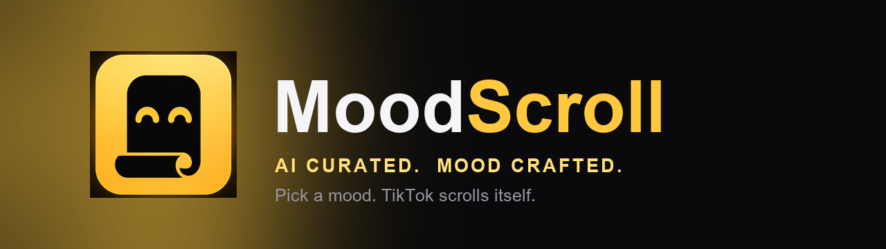
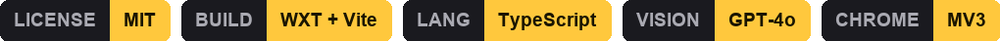
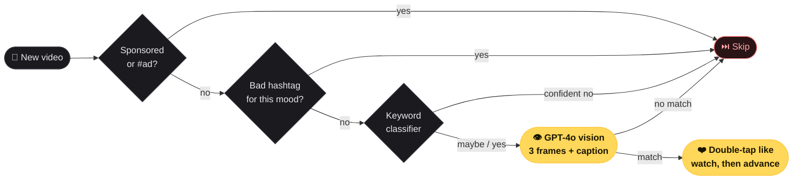

<div align="center">



<br/><br/>



<br/><br/>

### Pick a mood. TikTok scrolls itself.

A Chrome extension that classifies every video on your For You feed with vision AI,<br/>
auto-likes the matches, and skips everything else, so the algorithm finally learns what you actually want.

[**⬇️ Install**](#-install) &nbsp;·&nbsp; [**📖 Setup guide**](./SETUP.md) &nbsp;·&nbsp; [**🧩 Modes**](#-modes) &nbsp;·&nbsp; [**⭐ Star this repo**](https://github.com/xiaohkk/mood-scroll/stargazers)

<br/>

<a href="./mood-scroll-demo.mp4"></a>

<sub>▶︎ <a href="./mood-scroll-demo.mp4">Watch the 30-second demo</a></sub>

</div>

<br/>

---

## 🧩 Modes

One tap and the feed bends to you. Visual moods go straight to vision; text-heavy moods short-circuit on keywords for speed.

| | Mode | What it matches |
|:--:|:--|:--|
| ⏩ | **Auto Scroll** | Hands-free. Plays your normal feed, auto-likes, advances every 5s. |
| 🧠💀 | **Brain Rot** | AI slop, stacked edits, Skibidi, sigma slow-mo. |
| 🍳 | **Cooking** | Real recipe demos and technique. Skips food reviews. |
| 😂 | **Laugh** | Genuine comedy. Sketches with punchlines, witty edits. |
| 💎 | **LARP** | Wealth flex. Lambos, Rolexes, mansions, cash. |
| 💪 | **Fitness** | Gym physique. Lifts, pump checks, transformations. |
| 💅 | **Baddies** | Aesthetic and glam. OOTD, that-girl, slow-mo walks. |
| ✨ | **Custom** | Type any niche, like `vintage car restoration` or `60s rock`. |

<br/>

## ⚙️ How it works

Cheap checks first, vision only when it counts. Most videos never reach the API; free filters catch the obvious mismatches in milliseconds.



| Step | Cost |
|:--|:--|
| **1. Sponsored skip** — TikTok ads and `#sponsored` always skip | 🟢 free |
| **2. Negative hashtag pre-skip** — known-bad tags for the mode skip instantly | 🟢 free, ~5ms |
| **3. Keyword classifier** — confident non-matches skip with no API call | 🟢 free, ~10ms |
| **4. GPT-4o vision** — 3 frames plus the caption decide the close calls | 🟡 ~1 to 2s |
| **5. Match → double-tap like → advance** — native gesture, then scroll | ⚡ strong signal |

> Visual modes (LARP, Baddies, Brain Rot, Fitness) skip steps 2 and 3 and go straight to vision, because the frame is the truth.

<br/>

## 🪄 Smart features

| | | |
|:--|:--|:--|
| 🎯 **Two-phase training** | 📱 **Phone Mode** | 📊 **Session receipt** |
| Engages the broad cluster first to retune the algorithm fast, then narrows to strict matches once locked in. | One click shrinks Chrome to a 440px strip and hides all of TikTok's UI but the video. | Download a PNG of what categories you actually watched this session. |
| ❤️ **Double-tap like** | 🔁 **Loop watchdog** | 🔄 **Reset algo** |
| Native double-tap gesture, a stronger signal than the sidebar button. | Polls playback so videos never silently loop. | Clears training state and opens TikTok's content preferences. |

<br/>

## 🚀 Install

<details open>
<summary><b>60-second setup</b></summary>

<br/>

1. **Download** `mood-scroll-extension.zip` from this repo and unzip it.
2. Open <kbd>chrome://extensions</kbd> and toggle on **Developer mode** (top-right).
3. Click **Load unpacked** and select the unzipped **`chrome-mv3`** folder.
4. The options page opens. Paste your OpenAI API key and click **Save**.
5. Open **tiktok.com/foryou** and tap the yellow **✨** button to pick a mood.

Full guide, all modes, privacy notes, and troubleshooting live in **[SETUP.md](./SETUP.md)**.

</details>

<details>
<summary><b>Bring your own model</b></summary>

<br/>

Defaults to OpenAI **GPT-4o** with your own key (about `$0.005` per classification). Point the proxy URL on the options page at any OpenAI- or Anthropic-compatible endpoint to swap models or route through a proxy.

</details>

<br/>

## 🔒 Privacy

Everything runs locally in your browser. The only network request is to **your** chosen API endpoint, sending video frames plus caption text. Your API key, mode preference, and session data live in `chrome.storage.local` and are never uploaded. No accounts, no tracking, no analytics.

<br/>

## 🛠️ Build from source

```bash
npm install
npm run build    # outputs .output/chrome-mv3
npm run zip      # rebuilds mood-scroll-extension.zip
```

Built with **[WXT](https://wxt.dev)** (TypeScript + Vite), a Shadow-DOM overlay, and the Canvas API for frame capture.

<br/>

## 🗺️ What's next

- **Instagram Reels & YouTube Shorts.** Same vision-classifier infrastructure, different DOM. The hard work is done.
- **Mood scheduling.** "Cooking in the morning, brain rot at night" without switching modes by hand.
- **Negative modes.** "Show me anything except politics and engagement bait." Pick what to avoid, not just what to see.
- **End-of-session receipt.** An honest visual of how many minutes you watched and what you actually consumed, to look at before opening TikTok again.
- **Chrome Web Store.** Ship as an unlisted extension so it's shareable without sideloading a zip.

<br/>

---

<div align="center">

**[MIT License](./LICENSE)** &nbsp;·&nbsp; maintained by **[Jay Wang](https://github.com/xiaohkk)** &nbsp;·&nbsp; built with [WXT](https://wxt.dev)

<sub>Not affiliated with TikTok. Automating engagement may conflict with TikTok's Terms; use at your own discretion.</sub>

</div>
